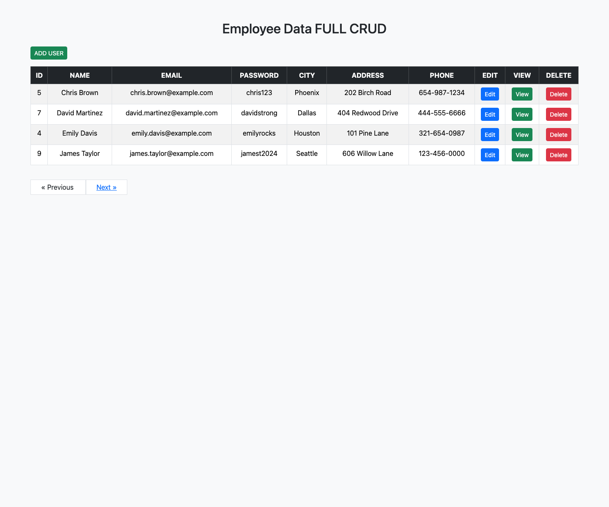

# Laravel Employee CRUD

A simple employee management application built with Laravel 11. It demonstrates the complete CRUD workflow: create, read, update, and delete employee records.

## Features

- View employees in a paginated table
- Add a new employee
- View an individual employee's details
- Edit employee information
- Delete an employee record
- MySQL database with sample employee data
- Bootstrap 5 responsive interface

## Technology

- PHP 8.2 or later
- Laravel 11
- MySQL
- Bootstrap 5

## Screenshots

### Employee list

Displays employee records with actions to add, view, edit, and delete users.



## Installation

1. Clone the repository and enter the project directory.

   ```bash
   git clone <repository-url>
   cd LARAVELCRUD
   ```

2. Install PHP dependencies.

   ```bash
   composer install
   ```

3. Create the environment file and application key.

   ```bash
   cp .env.example .env
   php artisan key:generate
   ```

4. Start the MySQL server in MAMP and configure the database connection in `.env`. MAMP's default MySQL connection uses port `8889` and the `root` / `root` credentials.

   ```env
   DB_CONNECTION=mysql
   DB_HOST=127.0.0.1
   DB_PORT=8889
   DB_DATABASE=laravelcrud
   DB_USERNAME=root
   DB_PASSWORD=root
   ```

5. Create the database, run migrations, and add sample employees.

   ```bash
   /Applications/MAMP/Library/bin/mysql80/bin/mysql -h 127.0.0.1 -P 8889 -u root -proot -e "CREATE DATABASE IF NOT EXISTS laravelcrud"
   php artisan migrate --seed
   ```

6. Start the application.

   ```bash
   php artisan serve
   ```

Open [http://127.0.0.1:8000](http://127.0.0.1:8000) in your browser.

## Routes

| Method | URI | Purpose |
| --- | --- | --- |
| GET | `/` | Redirects to the employee list |
| GET | `/employee` | List employees |
| GET | `/newuser` | Show the add-employee form |
| POST | `/adduser` | Create an employee |
| GET | `/employee/{id}` | View one employee |
| GET | `/edituserview/{id}` | Show the edit form |
| POST | `/update/{id}` | Update an employee |
| GET | `/deleteuserview/{id}` | Delete an employee |

## Project structure

```text
app/Http/Controllers/employeecontroller.php  # CRUD actions
app/Models/employee.php                      # Employee model
database/migrations/                          # Database schema
database/seeders/employeeseeder.php           # Sample employee records
resources/views/                              # Blade templates
routes/web.php                                # Application routes
```

## License

This project is open source and available under the [MIT License](LICENSE).
